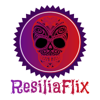

# Desafio Front-end ResiliaFlix V2.0 


# Pré Requisitos: 

```Utilizar Bootstrap e todas as páginas devem conter navbar e rodapé. As APIs da Via CEP e do OMDB. ```

# Configurações do site:
## Página inicial (home):
```
Capa de 12 filmes com página de informações; 
Informações (coletadas via API) do filme em questão.

Página de busca de filmes e séries:
Com formulário para buscar por nomes de filmes;
Relata problemas como filme não encontrado;
Contém resultado da busca); 
```
## Cadastro de usuário:
```Formulário com:

Dados do usuários.
```
## Página de log in:
```
Formulário com:

Usuário;
Senha; 
```
## Página de recuperação de senha: 
```Formulário com:
Pedido de e-mail de cadastro.
Confirmação de e-mail enviado 
```
## Página de contato:
```Devs envolvidos no projeto.```


## [Site]( https://felipe-streva.github.io/ResiliaFlix_2.0/home.html)
